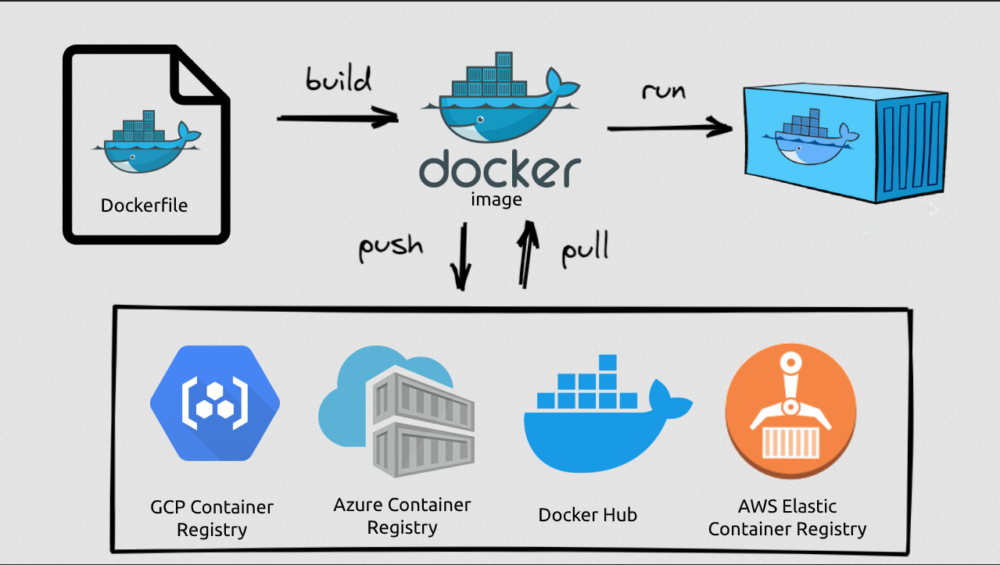

### Docker

Docker is an open-source platform that allows you to *automate the deployment and management of applications* within lightweight, isolated containers. It provides a consistent environment for running software, regardless of the underlying infrastructure.



##### Here are some key concepts and components of Docker:

1. **Containers**:\
Docker uses containers to encapsulate applications and their dependancies. A container is a *running instance of an image*. A container is a lightweight, standalone *executable package* that includes everything needed to run an application, such as code, runtime, system tools, libraries, and settings.

2. **Images**:\
Containers are created from Docker images. An image is a *read-only template* that contains the instructions for creating a container. It includes the application code and all the dependencies needed to run the application. Images can be built from scratch or based on existing images available on Docker Hub or private repositories.

3. **Docker Engine**:\
Docker Engine is the *runtime* that enables the creation and execution of containers. It manages the container lifecycle, including starting, stopping, and monitoring containers. Docker Enginer runs on the host machine and provides an API and command-line interface (CLI) to interact with Docker.
 
4. **Dockerfile**:\
A Dockerfile is a text file that contains a set of instructions for building a Docker image. It specifies the base image, software dependencies, configuration settings, and commands needed to create the image.

5. **Docker Compose**:\
Docker Compose is a tool for defining and running multi-container Docker applications. It uses a YAML file to define the services, networks, and volumes required by an application. Compose simplifies the process of managing complex, interconnected containers as a single unit.

6. **Docker Registry**:\
Docker Registry is a repository for storing and distributing Docker images. *Docker Hub* is the default public registry provided by Docker, but you can also set up private registries to store images within your organization. For example, [Docker Hub](hub.docker.com) -- contains official docker images.

7. **Orchestration**:\
*Docker Swarm* and *Kubernetes* are popular orchestration platforms that allow you to manage and scale Docker containers across a cluster of machines. They provide features like container schedulling, load balancing, service discovery, and automaged scaling.

##### Benefits of using Docker:

- **Portability**:\
Docker containers provide a consistent environment, making applications easily portable across different machines, operating systems, an cloud platforms.

- **Scalability**:\
Containers can be scaled up or down quickly to handle varying workload demands. Docker Swarm and Kubernetes provide tools for orchestrating containerized applications at scale.

- **Isolation**:\
Containers provide process isolation, ensuring that applications run independently without interfering with each other or the underlying system.

- **Resource efficiency**:\
Containers are lightweight, as they share the host system's kernel, enabling more efficient resource utilization compared to virtual machines. 

- **Rapid deployment**:\
Docker simplifies the application deployment process by packaging the application and its dependencies into containers, allowing faster and more reliable deployment.


##### Info:
- **Port Binding**:\
Bind the container's port to the host's port to make the service available to the outside world. Only one service can run on a specific port on the host, e.g. only one service can run on port 9000.

- **Remember**:\
A Docker image consists of layers.
	- **Each instruction in the Dockerfile creates one layer.**
	- These layers are stacked & each one is a delta of the changes from the previous layer.

##### Commands:

- `docker images` = List all Docker images.
- `docker ps` = List running containers.
	- `-a` or `--all` = Lists all containers (stopped and running).
- `docker pull {image-name}` = Pulling image {image-name} from Docker Hub.
- `docker run {image-name}:{image-tag}` = Creates a container from given image and starts it. Creates a new container. Doesn't re-use previous container.
	- `-d` or `--detach` = Runs a container in background and prints the container ID.
	- `-p {HOST_PORT}:{CONTAINER_PORT}` or `--publish {HOST_PORT}:{CONTAINER_PORT}` = Publish a container's port to the host.
	- `--name {container-name}`: Assign a name to the container.
- `docker logs {container-ID}` = View logs from service running inside the container (which are present at the time of execution).
- `docker stop {container-ID}` = Stop one or more running containers.
- `docker start {container-ID}`: = Start one or more stopped containers.
- `docker build -t {image-name}:{image-tag} .` =
	- `-t` or `--tag` = Sets a name and optionally a tag in the "name:tag" format.
- `docker build -t {image-name}:{image-tag} {path}` = Builds a Docker image from a Dockerfile. 


##### Structure of Dockerfile:

- Dockerfiles start from a parent image or **"base image"**
- It's a Docker image that your image is based on. You choose the base image, **depending on which tools you need** to have available.
- `FROM`
	- Dockerfiles **must begin** with a FROM instruction
	- Build this image from the specified image
- `RUN`
	- Will execute any command in a shell **inside** the container environment
- `COPY`
	- Copies files or directories from **<src>** and adds them to the filesystem of the container at the path **<dest>**
	- While `RUN` is executed in the container, `COPY` is executed on the host
- `WORKDIR`
	- **Sets the working directory** for all following commands
	- Like changing into a directory: `cd ...`
- `CMD`
	- The instruction that is to be executed when a Docker container starts
	- There can **only** be **one "CMD" instruction** in a Dockerfile

 
##### Sample Dockerfile:

- Host directory tree:
```
.
|___src/
|   |___server.js
|___Dockerfile
|___package.json

```
- Dockerfile content:
```
FROM node:19-alpine
COPY package.json /app/
COPY src /app/
WORKDIR /app
RUN npm install
CMD ["node", "server.js"]
```
